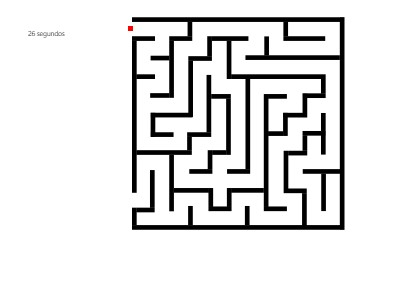

# Juego de Laberinto

   

## Características

* Laberinto generado aleatoriamente.
* Control de la bola con las flechas del teclado.
* Detección de colisiones con las paredes del laberinto.
* Temporizador.

## Tecnologías Utilizadas

* HTML
* CSS
* JavaScript

## Instalación

1. Clona el repositorio: `git clone <https://github.com/nanditavelasquez/laberinto>`
2. Abre el archivo `index.html` en tu navegador.

## Uso

* Usa las flechas del teclado (arriba, abajo, izquierda, derecha) para mover la bola.
* El objetivo es llegar a la salida del laberinto.

## Cómo Jugar

1. Abre el juego en tu navegador.
2. Usa las flechas del teclado para mover la bola por el laberinto.
3. Evita chocar con las paredes.
4. ¡Llega a la salida para ganar!

## Contribuciones

Las contribuciones son bienvenidas. Por favor, crea un *issue* para discutir posibles cambios o mejoras.

## Contacto

Luisa Velásquez
luisafernandavelasquezmejia@gmail.com
